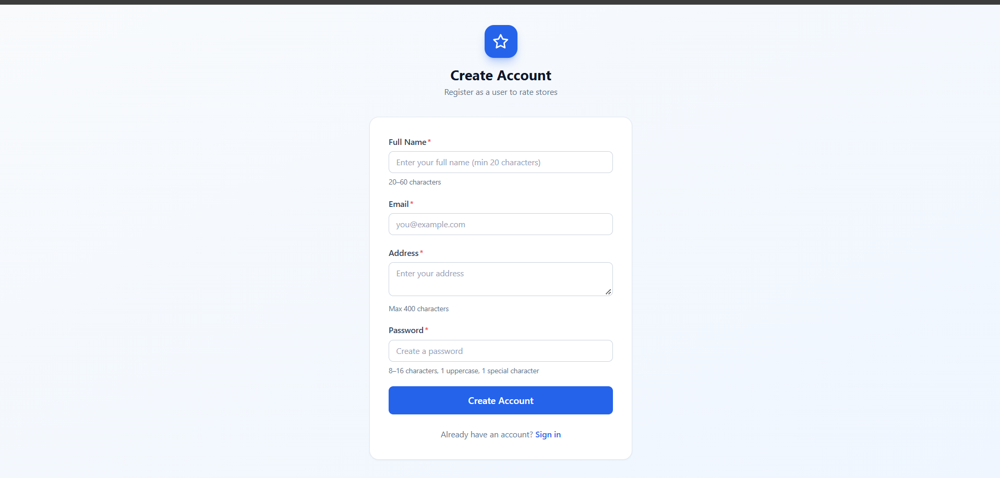
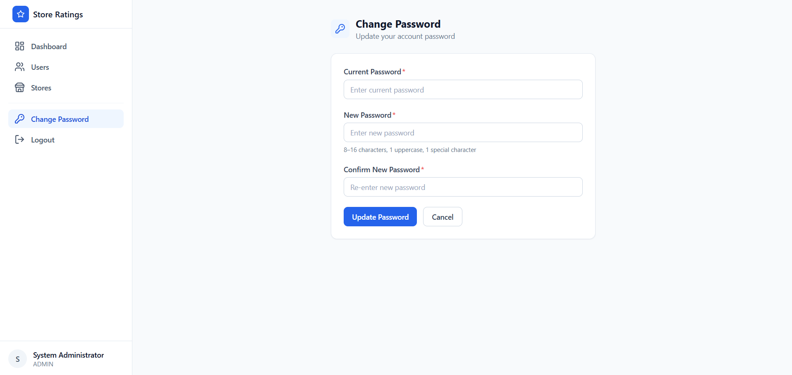
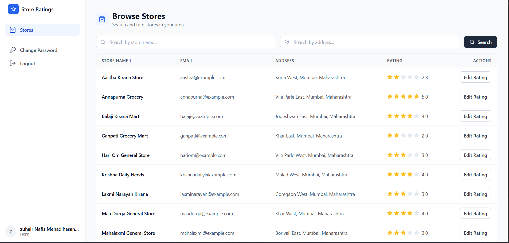
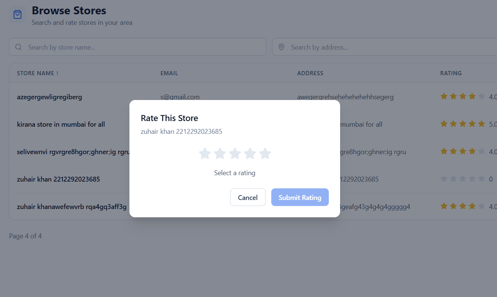
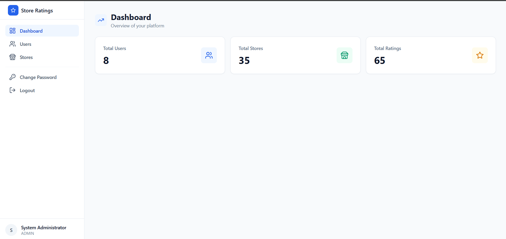
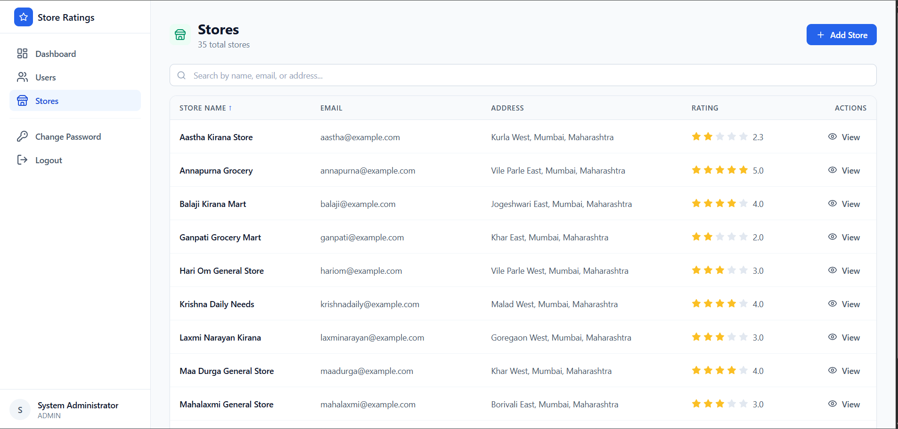
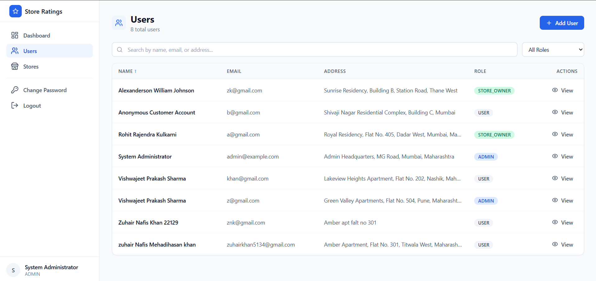
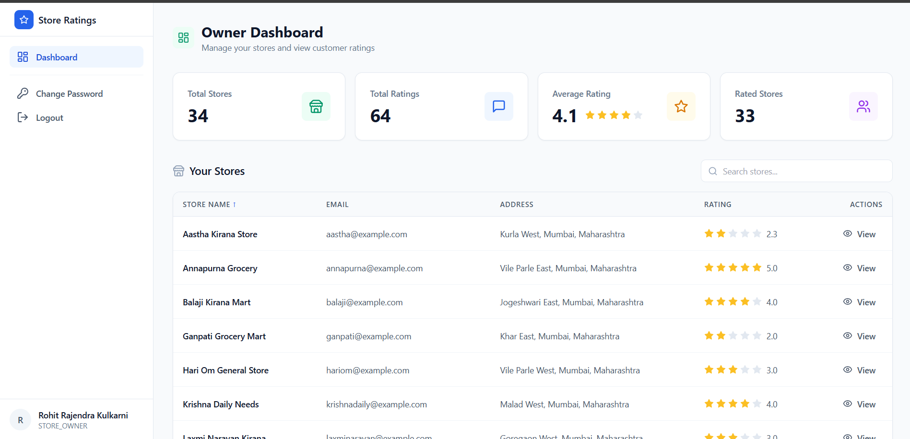
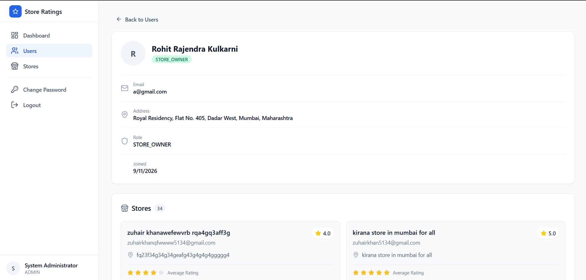
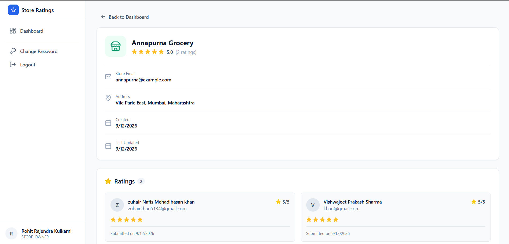

# Store Rating Management System

A full-stack store rating management application where users can browse stores and submit ratings, store owners can manage their stores, and admins can manage users, stores, and ratings.

## Project Links

- Demo: [Google Drive Demo](https://drive.google.com/file/d/19y3Qm_2OCuh6NHHjblGHIqyw2dEyNL5I/view?usp=sharing)
- Frontend: [Live Frontend](https://store-rating-system-lovat.vercel.app/)
- Backend: [Live Backend](https://store-rating-system-7wwv.onrender.com)

## Tech Stack

### Frontend

- React
- TypeScript
- Tailwind CSS
- React Query

### Backend

- NestJS
- Prisma
- PostgreSQL
- JWT Authentication

## Features

- User authentication
- User registration
- Role-based access control
- Browse and search stores
- Submit and update store ratings
- Store owner dashboard
- Store details and ratings
- Admin dashboard
- User management
- Store management
- Rating management
- Change password
- Pagination
- Sorting and filtering

## Project Screenshots

### 1. Register Page

Users can create a new account by providing their required details.

### 2. Change Password

Users can securely change their account password.

### 3. User Stores

Users can browse available stores and view their ratings.

### 4. Rate Store

Users can submit or update their rating for a store.

### 5. System Dashboard

The system dashboard provides an overview of the application.

### 6. Store Management

Store owners can manage their stores and view store information.

### 7. User Management

Admins can view and manage registered users.

### 8. Admin Dashboard

The admin dashboard provides an overview of stores, users, and ratings.

### 9. Admin Stores

Admins can view and manage all stores in the system.

### 10. Admin Store Details

Admins can view detailed information about a specific store and its ratings.

